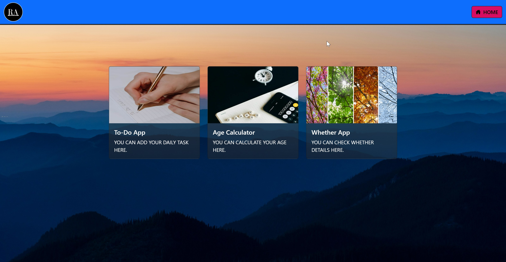

# React Mini Projects Collection

A collection of small React projects demonstrating core frontend skills, API integration, and responsive UI design. This repository includes:

- **To-Do App:** Manage tasks with add, delete, and mark-complete functionality.
- **Age Calculator:** Calculate age accurately from a birthdate input.
- **Weather App:** Fetch live weather data from OpenWeatherMap API with detailed info including temperature, humidity, wind speed, sunrise/sunset times, and country.

---

## Demo

Check out the live projects on Netlify: [React Mini Site](https://react-mini-site.netlify.app/)

---

## Features

### To-Do App
- Add, edit, and delete tasks
- Mark tasks as completed
- Responsive design for mobile and desktop

### Age Calculator
- Input date of birth and get accurate age
- Handles edge cases (leap years, future dates)
- Clean UI with instant results

### Weather App
- Search by city for current weather data
- Displays temperature, humidity, wind speed, sunrise & sunset
- Weather icons and country information
- Uses **environment variables** for API keys (`.env`)
- Responsive and modern UI with CSS gradients

---

## Tech Stack

- **Frontend:** React, Vite, CSS Modules, React Icons
- **API:** OpenWeatherMap
- **Deployment:** Netlify

---

## Vite + React Setup

This project uses Vite for a minimal, fast React setup with Hot Module Replacement (HMR). ESLint is configured for code quality.

Currently, two official React plugins are available:

- [@vitejs/plugin-react](https://github.com/vitejs/vite-plugin-react/blob/main/packages/plugin-react) uses [Babel](https://babeljs.io/) for Fast Refresh
- [@vitejs/plugin-react-swc](https://github.com/vitejs/vite-plugin-react-swc) uses [SWC](https://swc.rs/) for Fast Refresh

> The React Compiler is not enabled on this template. To add it, see [React Compiler Installation](https://react.dev/learn/react-compiler/installation).

For production apps, consider using **TypeScript** with type-aware lint rules. See the [Vite React TypeScript template](https://github.com/vitejs/vite/tree/main/packages/create-vite/template-react-ts) for guidance.

---

## Screenshots

---
 

